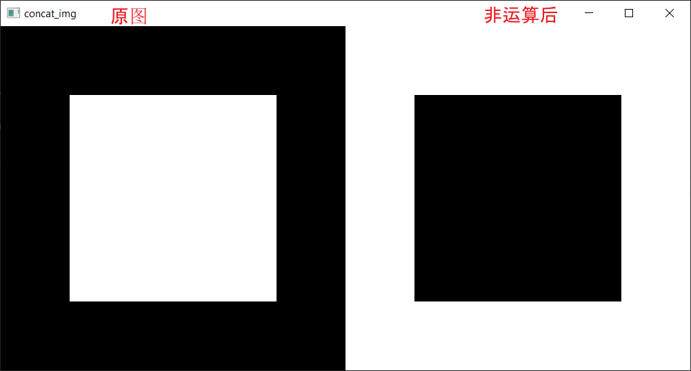
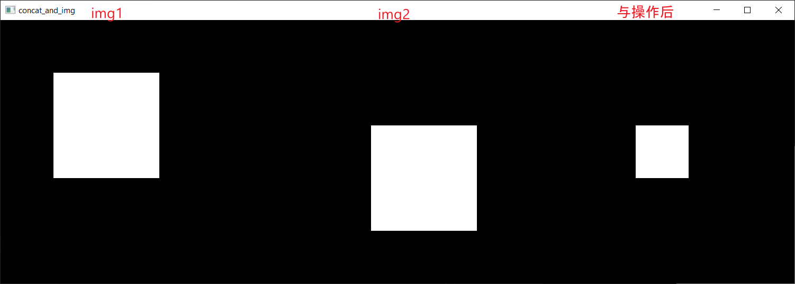
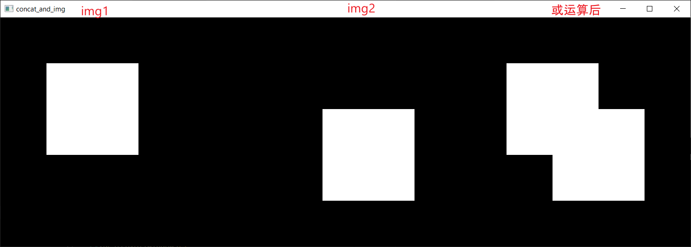
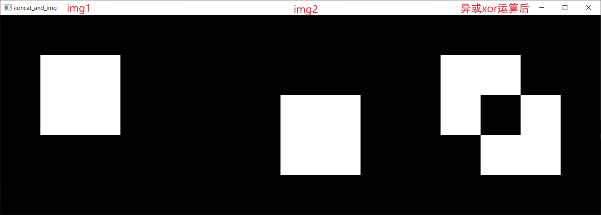

# OpenCV

## 图像四则运算
### 加法
- 方式一: 直接使用 + 号进行计算, out = (img1 + img2) % 256.
  - e.g., (226 + 50) % 256 = 20
- 方式二: 使用opencv提供的add(img1, img2), 结果若大于255, 则截取到255.
  - e.g., (226 + 50) = 276 -> 255

### 减法
- subtract(A, B): A - B

### 乘法
- multiply(A, B)
  
### 除法
- divide(A, B)

## 图像融合
out = alpha * A + beta * B + gamma
- addWeighted(A, alpha, B, beta, gamma)
  - A: 图像1
  - alpha: 图像1的权重
  - B: 图像2
  - beta: 图像2的权重.

## 图像位运算
与, 或, 非, 异或
- 非: bitwise_not(img), 黑白颠倒
  - 
- 与: bitwise_and(img1, img2)
  - 
- 或: bitwise_or(img1, img2)
  - 
- 异或: bitwise_xor(img1, img2): 交集的地方为0, 非交集的地方为1
  - 